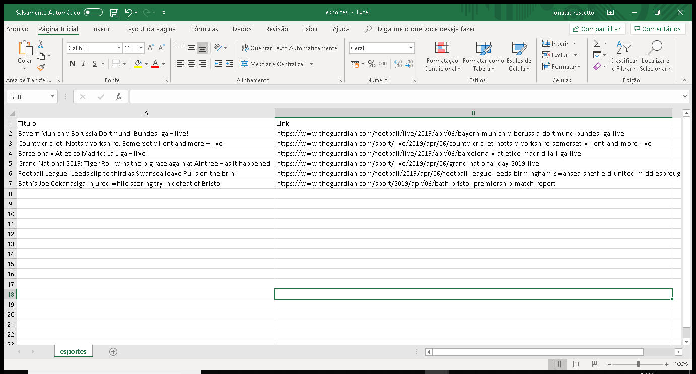
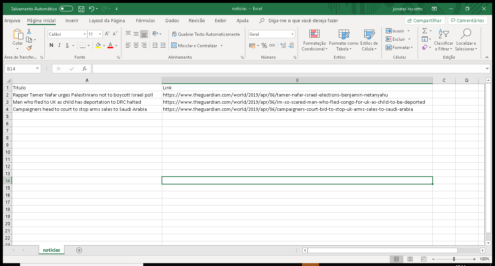

# News-TheGuardian
Get the latest news headlines using the API from "The Guardian" newspaper.
The guardian1.py script uses simple functions to enable often called procedures, function searchnews receives "The Guardian" API response, function searchnews process this data choosing specific themes for the headlines returning the news title and the news web link. Function exportar_csv writes down the specific theme results to csv file.

API utilizada: [THE GUARDIAN API](https://open-platform.theguardian.com/explore/ )

### Bibliotecas para funcionamento do script
``` sh
pip install os
pip install requests 
pip install json
pip install pandas
```

### Execução
``` sh
$ git clone https://github.com/jonatasrossetto/News-TheGuardian.git
$ cd news-theguardian
$ pip install os
$ pip install requests 
$ pip install json
$ pip install pandas
$ python guardian1.py
```

### Arquivo gerado



### Desenvolvedor

 - Jônatas Rossetto

 License
 ----
 **Free Software!** A documentação está atualmente armazenada [aqui](https://github.com/jonatasrossetto/News-TheGuardian)
